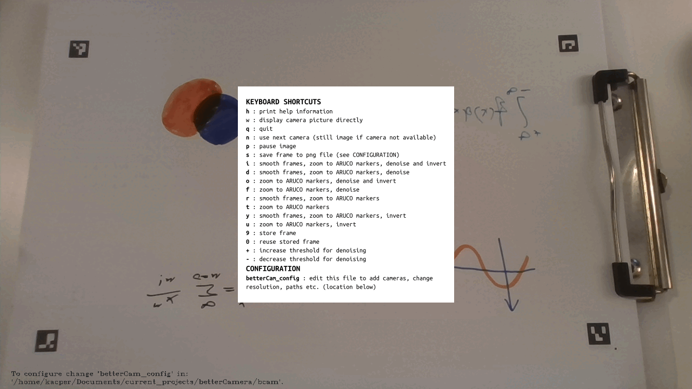

# betterCam

Turn web cam into a black / white board:



## introduction

Improved version of
[cam_board](https://github.com/kacpertopol/cam_board). 

## installation

### pip

You can install **betterCamera** using [pip](https://en.wikipedia.org/wiki/Pip_(package_manager)).
More information on installing and using the **pip** python package menager 
is available in [this informative article](https://www.makeuseof.com/tag/install-pip-for-python/).

If you're on *linux* and *mac* open a terminal and run:
```sh
TODO
```
If you're on *windows* open the command line and run:
```sh
TODO
```


### git

If you are familiar with `git` and `python 3` then 
make sure you have the `numpy`, `opencv-python` and `opencv-contrib-python`
libraries installed before cloning the [repository](https://github.com/kacpertopol/betterCamera).
The main script is `betterCamera`.

## usage

The program can be launched from the  terminal:

```
$ betterCamera
```

Control is via keyboard shortcuts. A list of special keys
is available by pressing `h`. To quit the program hit `q`:


## configuration

The path to a directory containing the configuration file `betterCam_config` is 
displayed at the very bottom of the window
after pressing the `h` key. All configuration is done by modifying this file. 
Don't be afraid to tinker with the settings, if you mess up, just replace `betterCam_config`
with the [default configuration file](./bcam/betterCam_config).

Configuration settings are entered using a simple `key = value` syntax. For example, the
number of buffered perspective matrices, `buffer` can be decreased from the default 20
to 10 by changing:
```
buffer = 20
```
to 
```
buffer=10
```
Each configuration
option is paired with a comment describing the setting, comments are lines starting with a `#`.
Additionally, 
sections are marked using square brackets, for example `[perspectiveMatrix]`. 
