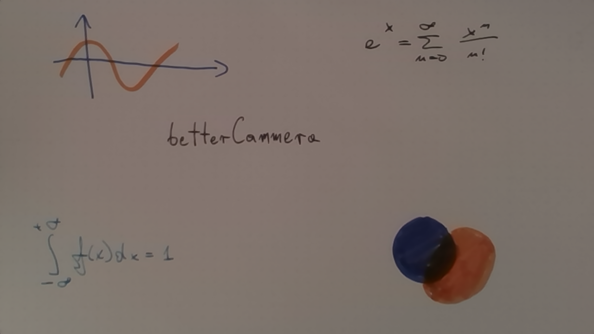

# betterCam

Turn web cam into a black / white board:


This is an improved version of
[cam_board](https://github.com/kacpertopol/cam_board).  

## installation

### pip

You can install **betterCamera** using [pip](https://en.wikipedia.org/wiki/Pip_(package_manager)).
Information on the installation and usage of **pip**, on different operating systems, is available [here](https://pip.pypa.io/en/stable/installation/).
and [here](https://pip.pypa.io/en/stable/) respectively.
Many additional resources are available online, see for example [this informative article](https://www.makeuseof.com/tag/install-pip-for-python/).

If you're on *linux* or *mac* open a terminal and run:
```sh
TODO
```
If you're on *windows* open the command line and run:
```sh
TODO
```


### git

If you are familiar with `git` and `python 3` then 
make sure you have the `numpy`, `opencv-python` and `opencv-contrib-python`
libraries installed before cloning the [repository](https://github.com/kacpertopol/betterCamera).
The main script is `betterCamera`.

## usage

The program can be launched from the  terminal:
```
$ betterCamera
```
Control is via keyboard shortcuts. A list of special keys
is available by pressing `h`. To quit the program hit `q`:


### printing ARUCO markers

Printouts with the ARUCO markers for a 16x9 camera aspect ration are available 
(the circle marks the top left corner of the page):

- [PDF](./to_print/a4_16_by_9_tiny_inside.pdf) and [SVG](./to_print/a4_16_by_9_tiny_inside.svg) for A4 paper
- [PDF](./to_print/letter_16_by_9_tiny_inside.pdf) and [SVG](./to_print/letter_16_by_9_tiny_inside.svg) for LETTER paper

Printouts for other aspect ratios can be prepared using 
[this](./to_print/symbols/4x4_1000-0.svg), [this](./to_print/symbols/4x4_1000-1.svg),
[this](./to_print/symbols/4x4_1000-2.svg), and [this](./to_print/symbols/4x4_1000-3.svg)
SVG image. Just make sure they are appropriately oriented on the page and that the innermost
rectangle formed by the ARUCO marker corners has the correct aspect ratio.

All ARUCO symbols were generated using [this handy website](https://chev.me/arucogen/).

### quitting

This is important 😀 Just hit `q`.

### getting help

The `h` key activates the help screen:

with a description of all the special keys.

### displaying the camera picture directly

Hitting `w` just displays the camera picure directly:


### zooming into the ARUCO markers

Two keys can be used to achieve this, `r` and `t`:

Small movements of the camera might cause jitter when using `t`.
Pressing `r` will additionally smooth out the image and introduce a 
small time delay.

### zooming into the ARUCO markers and inverting colors

Two keys can be used to achieve this, `y` and `u`:

Small movements of the camera might cause jitter when using `u`.
Pressing `y` will additionally smooth out the image and introduce a 
small time delay.

### zooming into the ARUCO markers and removing background

This can be useful for saving slide presentations.
Two keys can be used to achieve this, `d` and `f`:

Small movements of the camera might cause jitter when using `f`.
Pressing `d` will additionally smooth out the image and introduce a 
small time delay.

### zooming into the ARUCO markers, removing background, inverting colors

Two keys can be used to achieve this, `i` and `o`:

Small movements of the camera might cause jitter when using `o`.
Pressing `i` will additionally smooth out the image and introduce a 
small time delay.

### adjusting de-noising parameter

When using `d`, `f`, `i` or `o` it might be helpful to adjust
the de-noising parameter used to remove the background. This
can be achieved by pressing `+` or `-`.

## configuration

The path to a directory containing the configuration file `betterCam_config` is 
displayed at the very bottom of the window
after pressing the `h` key:

All configuration is done by modifying this file. 
Don't be afraid to tinker with the settings, if you mess up, just replace `betterCam_config`
with the [default configuration file](./bcam/betterCam_config).

Configuration settings are entered using a simple `key = value` syntax. For example, the
number of buffered perspective matrices, `buffer` can be decreased from the default 20
to 10 by changing:
```
buffer = 20
```
to 
```
buffer=10
```
Each configuration
option is paired with a comment describing the setting.
Comments are lines starting with `#`.
Additionally, 
sections are marked using square brackets, for example `[perspectiveMatrix]`. 
